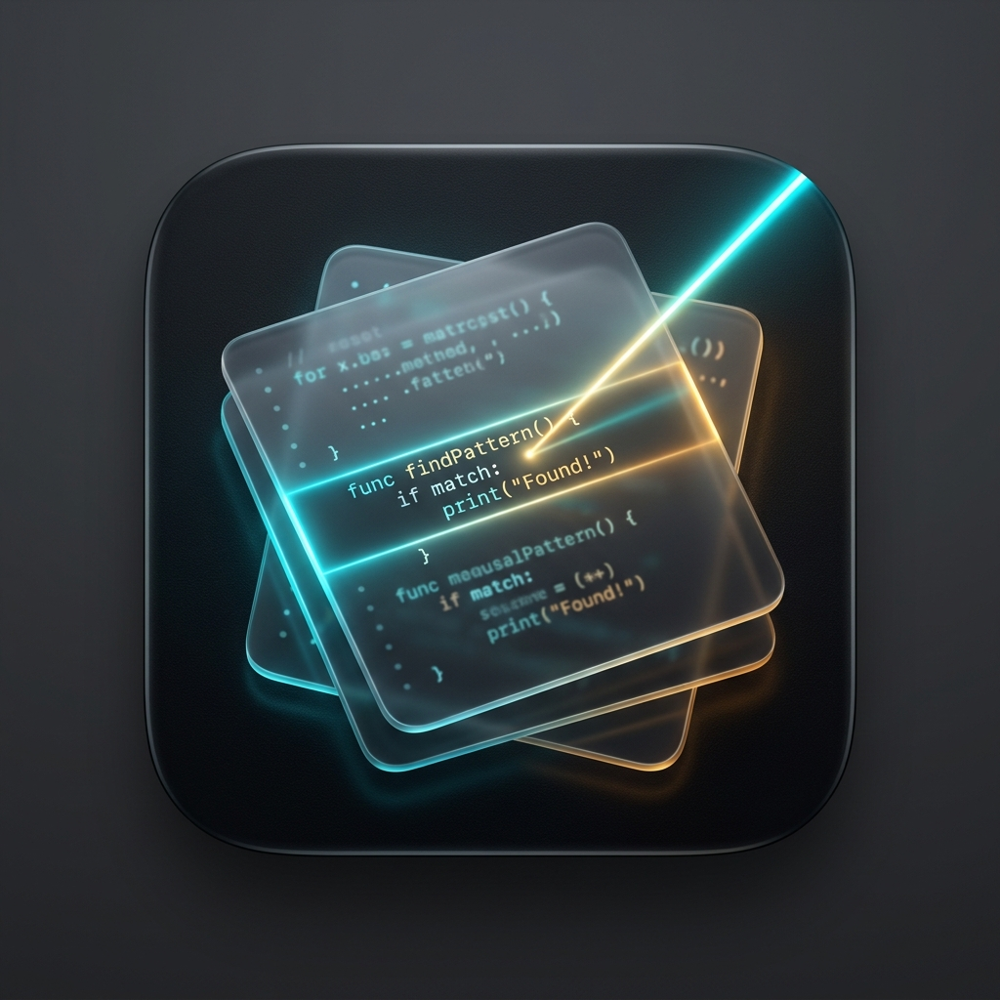

# FastGrep 快摘 ⚡️

<p align="center">
  
</p>

<p align="center">
  <strong>专为 macOS 打造的高效本地文本快摘、代码检索与剪贴板管理器</strong>
</p>

<p align="center">
  
  
  
  
</p>

---

## 🌟 核心特性

- ⚡️ **毫秒级模糊搜索与代码快摘**
  - 支持监控本地指定代码库与文档目录（`.swift`, `.py`, `.js`, `.ts`, `.md`, `.json`, `.yaml`, `.txt` 等）。
  - 无论文件路径多深，输入关键词即刻进行毫秒级匹配定位与内容摘取。

- 📋 **增强型剪贴板历史**
  - 自动捕获复制内容并持久化存储，随时通过快捷键回溯、搜索并再次使用。
  - **隐私保护**：智能识别并自动过滤主流密码管理器（1Password、Bitwarden、KeepassXC 等）复制的敏感内容。

- 🌐 **本地 AI 即时翻译 (基于 Ollama)**
  - 针对剪贴板最新文字，一键呼出悬浮翻译面板进行毫秒级中英双向互译。
  - 深度集成本地 Ollama 与腾讯混元轻量级翻译模型 `MedAIBase/Tencent-HY-MT1.5:1.8b`。
  - 完全离线运行，隐私安全，无需联网，无需购买第三方 API。

- 📂 **深度系统集成与快捷操作**
  - **一键复制**：直接回车（`Return`）复制当前选中的代码或文本段落。
  - **直接打开**：快捷键 `⌥ Return` 或点击按钮，使用系统默认应用程序打开文件。
  - **访达定位**：快捷键 `⌘ Return` 或点击按钮，在 Finder 中高亮显示并定位文件所在目录。

- 🔒 **严格的安全沙盒机制（App Sandbox）**
  - 完全遵循 macOS 原生沙盒规范，采用 Apple 安全范围书签（Security-Scoped Bookmarks）。
  - 电脑重启或应用重开后自动维持监控目录的读写权限，安全无侵入。

- 🚀 **原生现代体验**
  - 状态栏常驻（Menu Bar App），轻量无干扰，内存占用极低。
  - 原生 macOS 14+ 现代设计，完美自适应浅色与深色（Dark Mode）外观。
  - 支持系统原生 **开机自启动**（基于 `SMAppService`，开箱即用）。

---

## ⌨️ 常用快捷键速查

| 操作 | 快捷键 / 触发方式 | 说明 |
| **全局呼出 / 隐藏** | `⌃ ⌘ Space` (Control + Command + 空格) | 可在偏好设置中自由更改 |
| **剪贴板快速翻译** | `⌃ ⌥ T` (Control + Option + T) | 自动调用本地 Ollama Tencent-HY-MT1.5 模型即时中英互译 |
| **复制所选内容** | `Return` (回车) | 复制内容到系统剪贴板 |
| **打开对应文件** | `⌥ Return` (Option + 回车) | 使用系统默认编辑器打开该文件 |
| **在访达中定位** | `⌘ Return` (Command + 回车) | 在访达 (Finder) 中高亮该文件 |
| **切换剪贴板历史** | 状态栏右键菜单或面板入口 | 查看并搜索近期的剪贴板记录 |
| **AI 提示词模板** | 输入前缀 `/` | 呼出预设的 Prompt 模板 |

---

## 🌐 本地 AI 即时翻译功能与配置指南

FastGrep 内置了基于本地 Ollama 驱动的轻量级即时翻译功能，专为注重**隐私安全**与**极致响应速度**的用户打造。

### ✨ 特性亮点

- **全局极速唤起**：在系统任意应用中复制文本后，按下 `⌃ ⌥ T`（Control + Option + T），即可在屏幕中央呼出悬浮翻译面板。
- **本地腾讯混元模型**：默认接入 `MedAIBase/Tencent-HY-MT1.5:1.8b` 模型（仅 1.1GB 显存/内存），针对中英双向互译深度优化，单次翻译耗时仅 **200~300ms**。
- **中英双向智能识别**：自动检测源语言；包含中文自动翻译为英文，英文/其他语言自动翻译为中文。
- **极速键盘操作**：
  - `Return`（回车）：一键将译文复制至系统剪贴板并关闭窗口。
  - `Esc`：关闭翻译窗口。
  - 支持在窗口中实时编辑源文本、切换翻译方向与重新翻译。
- **100% 离线隐私保护**：所有推理计算均在本地设备运行，不发送任何数据到云端，敏感文本与商务资料绝无泄密风险。

### ⚙️ 环境配置与启用步骤

#### 步骤 1：安装与启动本地 Ollama
如果您的 Mac 尚未安装 Ollama，可通过 [Ollama 官网](https://ollama.com/) 下载或通过 Homebrew 安装：
```bash
brew install ollama
# 启动本地服务（默认运行在 http://127.0.0.1:11434）
ollama serve
```

#### 步骤 2：拉取腾讯混元轻量级翻译模型
在终端运行以下命令，下载并测试该模型：
```bash
ollama run MedAIBase/Tencent-HY-MT1.5:1.8b
```
*(下载大小约 1.1GB，下载完成后即可在本地离线运行)*

#### 步骤 3：在 FastGrep 中验证配置
1. 点击 macOS 顶部菜单栏的 FastGrep 图标，或右键选择 **「偏好设置...」**。
2. 切换至 **「AI 翻译」** 标签页：
   - **Ollama API 基础地址**：默认为 `http://127.0.0.1:11434`
   - **模型名称**：默认为 `MedAIBase/Tencent-HY-MT1.5:1.8b`
3. 点击 **「测试连接与模型」** 按钮，若提示 `✅ 连接成功！已检测到模型...` 说明本地环境已配置完毕。
4. 可点击 **「测试翻译窗口」** 立即体验悬浮翻译面板。

#### 步骤 4：自定义快捷键（可选）
在偏好设置 **「快捷键」** 标签页中，您可以自由更改：
- **全局主面板快捷键**（默认 `⌃ ⌘ Space`）
- **剪贴板即时翻译快捷键**（默认 `⌃ ⌥ T`）
支持一键键盘按键录制，保存后立即全局生效。

---

## 📥 下载与安装

### 方式一：下载预编译版本（推荐）

1. 从 [GitHub Releases](https://github.com/drinking/FastGrep/releases) 下载最新的 `FastGrep.dmg` 安装镜像。
2. 打开 DMG 文件，将 **FastGrep 快摘** 拖入 **Applications**（应用程序）文件夹。
3. 在应用程序中点击打开即可在右上角状态栏看到图标。

> [!TIP]
> **关于 macOS Gatekeeper 提示（“无法打开或已损坏”）**：
> 如果您下载的开源编译版本未经 Apple 付费证书签名公证，macOS 可能会阻止打开。只需打开终端运行以下命令即可正常运行：
> ```bash
> xattr -cr /Applications/FastGrep.app
> ```

### 方式二：从源码编译构建

确保已安装 Xcode 15 或更高版本：

```bash
# 1. 克隆代码仓库
git clone https://github.com/drinking/FastGrep.git
cd FastGrep

# 2. 编译 Release 版本
xcodebuild -project FastGrep.xcodeproj -scheme FastGrep -configuration Release -derivedDataPath ./build build

# 3. 产物生成在 ./build/Build/Products/Release/FastGrep.app
```

---

## 🛠️ 项目架构

```
FastGrep/
├── FastGrep/
│   ├── AppDelegate.swift              # 应用生命周期、状态栏图标与全局快捷键调度
│   ├── ContentView.swift              # 主搜索窗口视图
│   ├── UnifiedListItemView.swift      # 搜索结果项渲染（高亮、标签、快捷键绑定）
│   ├── ClipboardManager.swift         # 剪贴板监听、持久化与密码过滤
│   ├── ClipboardHistoryView.swift     # 剪贴板历史查看面板
│   ├── TranslationView.swift          # 本地 AI 悬浮即时翻译面板与弹窗控制器
│   ├── OllamaTranslationService.swift # 本地 Ollama 通信、Prompt 构造与连通性检测
│   ├── SettingsView.swift             # 偏好设置面板（监控目录、双快捷键、AI 翻译配置、开机自启）
│   ├── dbstore.swift                  # SQLite 数据库与安全书签持久化
│   ├── request.swift                  # 提示词与网络模块
│   ├── FastGrep.entitlements          # App 沙盒权限与安全书签声明
│   └── Assets.xcassets                # 应用与状态栏多分辨率矢量资产
└── FastGrep.xcodeproj                 # Xcode 工程文件
```

---

## 🤝 贡献与反馈

欢迎提交 Issue 和 Pull Request！如果你有任何好的建议或功能需求，请随时在 GitHub Discussions 或 Issues 中提出。

## 📄 开源许可证

本项目采用 [MIT License](LICENSE) 开源。